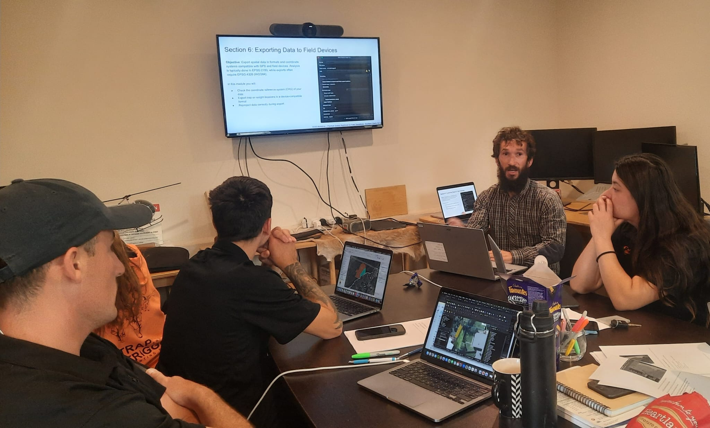
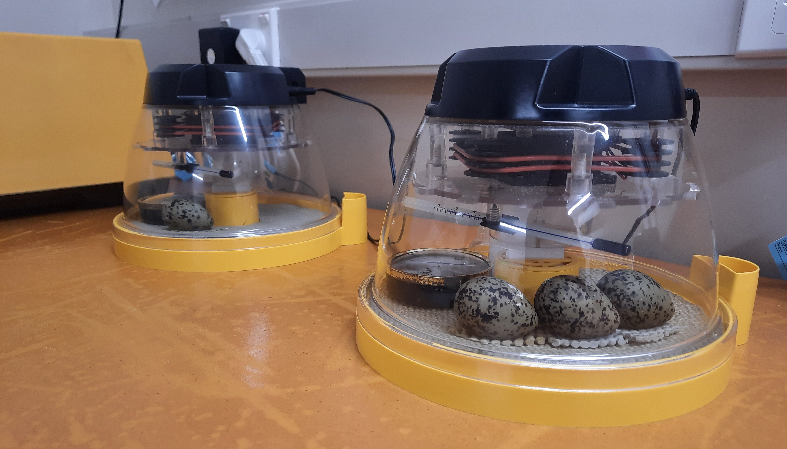

::: {.hero}
::: {.container}
::: {.eyebrow}
Statistics and decision support consultancy
:::

# Southern Clarity NZ

Southern Clarity NZ is a New Zealand-based statistics and decision-support consultancy helping organisations turn complex data into evidence that supports confident decisions.

::: {.hero-actions}
[Talk to us](contact.qmd){.button}
[What we do](#what-we-do){.button .button-secondary}
:::
:::
:::

::: {.section .container #what-we-do}

::: {.section-heading-spacer aria-hidden="true"}
:::

We deliver end-to-end analytical solutions, combining rigorous statistical modelling, reproducible workflows, and carefully applied AI-assisted tools with interactive decision-support systems that evolve as new data and questions emerge.

::: {.template-grid}
::: {.template-card}
### Statistical modelling
Build robust inferential and predictive models for complex, high-uncertainty decisions.
:::

::: {.template-card}
### Decision-support tools
Design interactive dashboards and scenario tools that help teams compare options and act faster.
:::

::: {.template-card}
### Reproducible analytics
Implement transparent, auditable workflows that update as new data and management questions emerge.
:::
:::
:::

::: {.section .container #philosophy}
## Our philosophy

::: {.section-intro}
Clarity, rigour, and client ownership are central to every engagement.
:::

::: {.template-grid}
::: {.template-card}
### Client ownership
You retain full ownership of your data, code, and tools.
:::

::: {.template-card}
### Transparent methods
Approaches are documented, reproducible, and easy to communicate to technical and non-technical audiences.
:::

::: {.template-card}
### Decision-ready outputs
Deliverables are designed to support real decisions, not just static analysis reports.
:::
:::
:::

::: {.section .container #selected-work}
## Selected work

::: {.case-grid}
::: {.case-card}
{.case-image}

### QGIS workshop for Trap & Trigger Ltd
Built reusable mapping workflows for operational teams, including data import standards, geoprocessing patterns, and export-ready outputs to reduce repeated manual steps.
:::

::: {.case-card}
{.case-image}

### Kakī population modelling for the Department of Conservation
Developed an integrated modelling framework to support long-term planning, quantify uncertainty, and identify where management effort can have the greatest impact.
:::
:::
:::

::: {.section .container #who-we-are}
## Who we are

Southern Clarity NZ was co-founded in 2025. Our work is led by strong applied consulting experience in statistical modelling, decision support, and production-ready analytical tool development.

Stefan brings 9+ years of consulting and delivery experience across government and industry contexts, with specialist capability in Bayesian modelling, advanced statistical analysis, and reproducible workflow design.

::: {.tool-list}
**Core tools:** R, QGIS, GitHub, Docker, and carefully applied AI-assisted tooling where it improves delivery quality and scalability.
:::
:::
